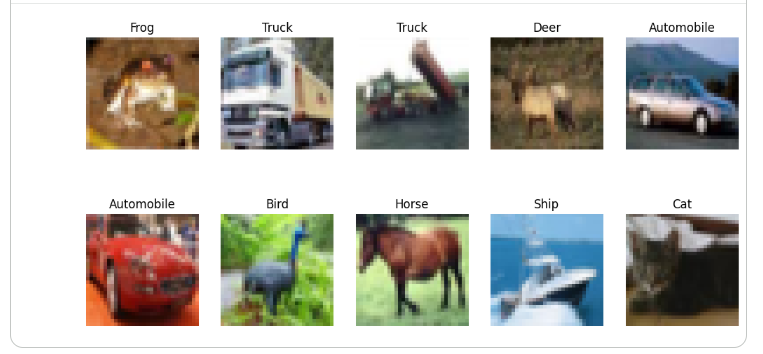

#  CNN-CIFAR10-Image-Classification

## Project Overview

This project implements a **Convolutional Neural Network (CNN)** for image classification using the **CIFAR-10** dataset with **TensorFlow** and **Keras**. The model is trained to classify images into one of the 10 object categories.

##  Objectives

- Build a CNN from scratch
- Train the model on the CIFAR-10 dataset
- Evaluate model performance
- Visualize training results
- Test predictions on unseen images

## Dataset

**Dataset:** CIFAR-10

The dataset contains **60,000 color images** of size **32×32** belonging to **10 classes**:

- Airplane
- Automobile
- Bird
- Cat
- Deer
- Dog
- Frog
- Horse
- Ship
- Truck

Training Images: **50,000**

Testing Images: **10,000**

##  Technologies Used

- Python
- TensorFlow
- Keras
- NumPy
- Matplotlib
- Scikit-learn
- Google Colab

##  CNN Architecture

The model includes:

- Conv2D Layers
- ReLU Activation
- MaxPooling2D
- Dropout
- Flatten Layer
- Dense Layers
- Softmax Output Layer

##  Model Evaluation

The project evaluates the model using:

- Training Accuracy
- Validation Accuracy
- Test Accuracy
- Loss
- Prediction Confidence


### CNN Classes



## How to Run

### Clone Repository

```bash
git clone https://github.com/RomaisaMalik01/CNN-CIFAR10-Image-Classification.git
```

### Install Dependencies

```bash
pip install -r requirements.txt
```
### Run Notebook

Open the notebook in **Jupyter Notebook** or **Google Colab** and run all cells.

## Repository Structure

```
CNN-CIFAR10-Image-Classification/

├── CNN_CIFAR10_Classification.ipynb
├── README.md
├── requirements.txt
├── LICENSE
└── images/
    ├── dataset_download.png
    ├── classes.png
    ├── feature_map.png
    ├── accuracy_with_augmentation.png
    ├── test_accuracy.png
    ├── prediction.png
    └── test_image.png
```

## Results

The CNN model successfully learned meaningful image features and achieved strong classification performance on the CIFAR-10 dataset.

## Future Improvements

- Transfer Learning
- ResNet50
- DenseNet201
- EfficientNet
- Model Deployment with Streamlit

## Author

**Romaisa Malik**

Computer Science Student | Machine Learning & Deep Learning Enthusiast

⭐ If you found this project useful, consider giving it a star on GitHub.
